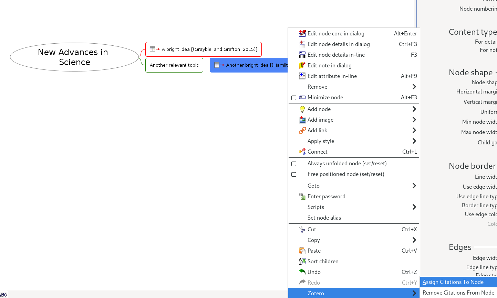

# freeplane-zotero

A Freeplane addon which makes it possible to assign citations from Zotero (an excellent open source reference manager) to any node on a Freeplane mind map.

## Features
- Assign one or more citations (references) to any of your mindmap nodes
- The node will automatically have a link that opens the relevant citation(s) in Zotero
- Refresh all citations of a mind map from Zotero if you made changes to your library



## How to build
- Download and install Freeplane Developer Tools from [this page](https://www.freeplane.org/wiki/index.php/Add-ons_(install)#Developer_Tools)
- Clone this repository using Git
- Execute the following commands:

```
export FREEPLANE_DIR='...' # Put your Freeplane installation directory here, e.g. /usr/share/freeplane
cd freeplane-zotero
./gradlew packageAddon
```

NOTE: Due to a bug, the packageAddon task may not complete successfully, quitting with the message 'WARNING: addons.devtools.releaseAddOn_on_single_node is not a valid menu item key.'. If this happens, go to `freeplane-zotero/build/addon`, open the .mm file there with Freeplane, then manually execute Tools/Developer Tools/Package addon for publication. This will generate the installation file.

- The addon installation file will be located at `freeplane-zotero/build/addon/freeplane-zotero-[version].addon.mm` . Please make sure you use the .mm file including the version number, as the other one is just a copy of the addon definition file that cannot be used for installation.

## How to install

- After building, double click `freeplane-zotero/build/addon/freeplane-zotero-[version].addon.mm` to install the plugin (Alternatively, open Tools/Addons in Freeplane and browse for this file, then click Install)

## Important Notice

This addon is currently at a very early development stage and is therefore considered unstable. Feel free to report any bugs or feature requests under Issues.

All contributions are welcome!
